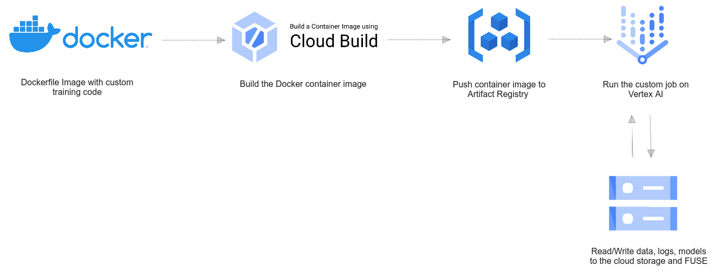

# ML on GCP

## Vertex AI training



***
Upload the data to the bucket
```bash
# upload a file
./upload_to_bucket.sh --type file /path/to/local/file.txt my-bucket-name
# upload a folder
./upload_to_bucket.sh --type folder /path/to/local/folder my-bucket-name
```

Setup the container
```bash
./setup_container_training_service.sh <your-project-id> <repo-name> <your-repo-description> <your-region> <your-image-name>
```
Note: <repo-name> does not support underscore, use dash instead.

